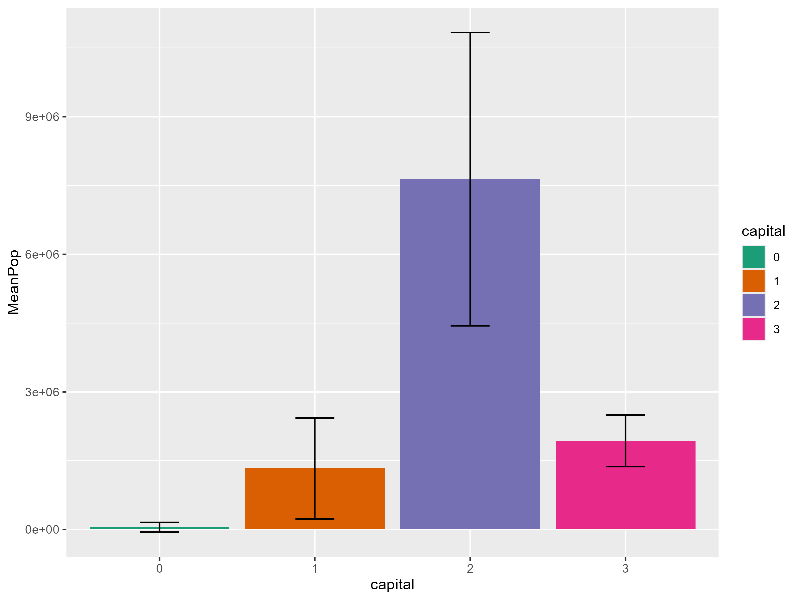
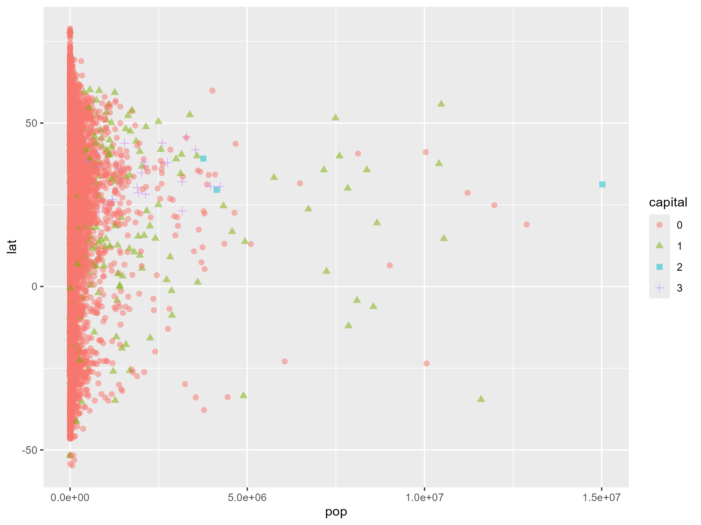
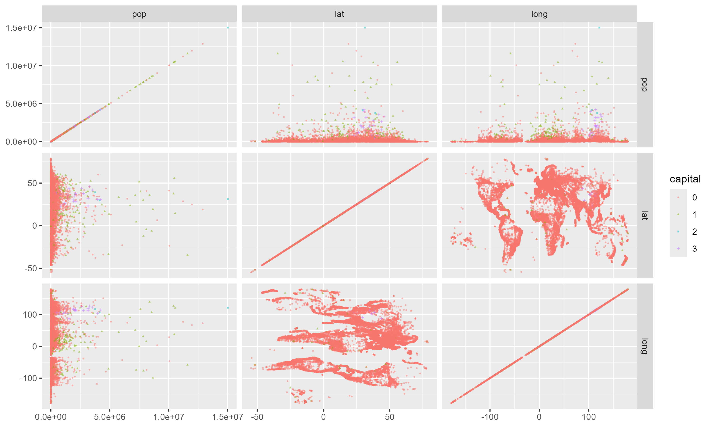
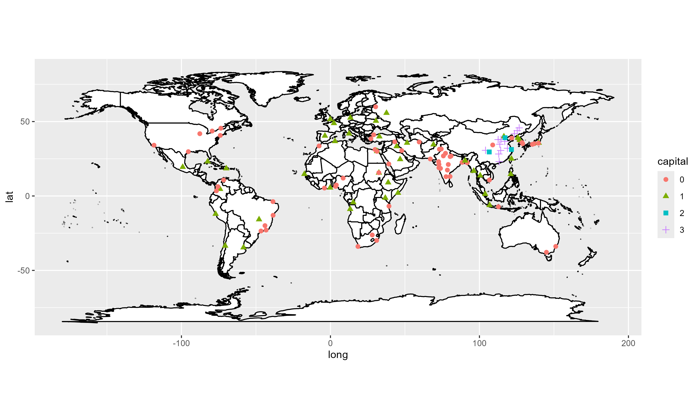
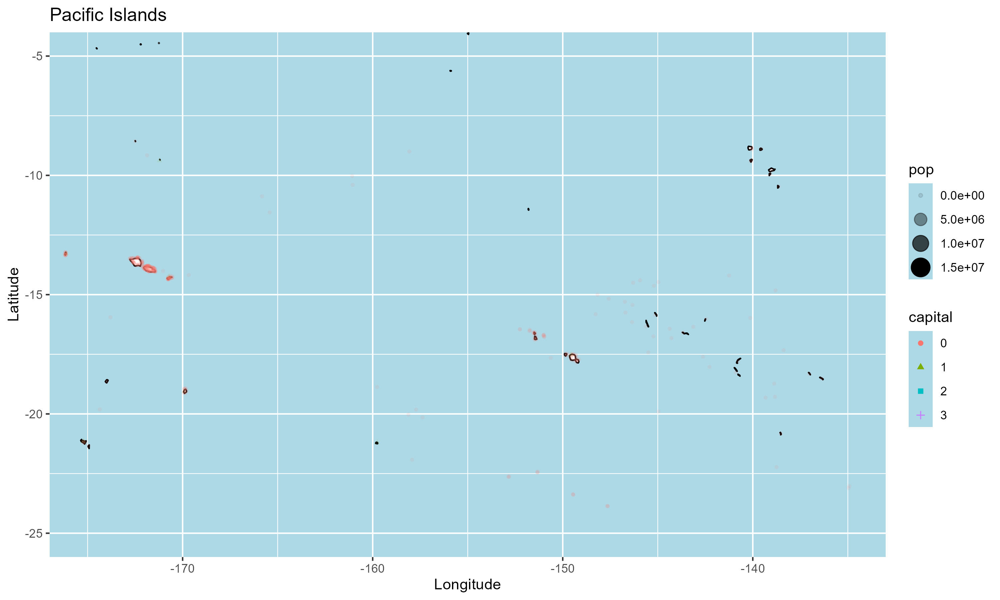

# DATA310-R-World-Population-Data
R scripts for my **DATA310 coursework** analyzing **world population statistics**, generating **plots** and **maps** using `ggplot2`, `maps`, and `ggforce`.

## 📂 Project Contents
- **`World_Population_Data_8-1.R`** - Analyzes global city populations, creating various **visualizations**.

## 📌 Setup Instructions
1. Install **R** and **RStudio** (if not already installed).
2. Install required R packages:
   ```r
   install.packages(c("tidyverse", "ggforce", "maps"))

## 📊 Visualizations

### 🌍 Bar Plot


### 📈 Scatter Plot


### 📊 Facet Matrix Plot


### 🌎 World Map Plot


### 🏝️ Pacific Map Plot

